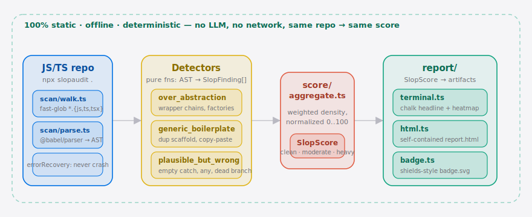

<!-- 语言：简体中文 · English → [README.md](./README.md) -->

<p align="center">
  
</p>

<p align="center">
  <a href="./LICENSE"></a>
  = 22" />
  <a href="https://www.npmjs.com/package/slopaudit"></a>
  
  
</p>

<p align="center">
  <b>你的 AI 编码 agent 写了其中一半，现在却要你来维护。<br/>SlopAudit 告诉你它到底有多糟 —— 以及糟在哪里。</b>
</p>

<p align="center">
  
</p>

---

## 目录

- [SlopAudit 是什么？](#slopaudit-是什么)
- [架构](#架构)
- [快速开始](#快速开始)
- [演示](#演示)
- [工作原理](#工作原理)
- [slop 类别](#slop-类别)
- [命令行用法](#命令行用法)
- [GitHub Action](#github-action)
- [SlopScore 徽章（病毒式传播闭环）](#slopscore-徽章)
- [定价](#定价)
- [路线图](#路线图)
- [参与贡献](#参与贡献)
- [许可证](#许可证)

---

## SlopAudit 是什么？

AI 编码 **agent** 出码飞快 —— 如今每个 JS/TS 仓库里，越来越大的比例是机器生成、只被草草 review、最终交到一个并非作者的人手上的代码。Agent 的 **Skill**、prompt 配置、复制粘贴来的脚手架（参见 [`Shubhamsaboo/awesome-llm-apps`](https://github.com/Shubhamsaboo/awesome-llm-apps) 与 [`affaan-m/everything-claude-code`](https://github.com/affaan-m/everything-claude-code) 这样的生态）正在堆积一种 linter 从不会标记的特殊债务：**slop（AI 垃圾代码债）**。

SlopAudit 是一个**零配置 CLI**，它审计一个现有的 JS/TS 仓库，量化其中的 AI 生成 slop 债务，并产出一个醒目的核心数字 —— **SlopScore（0–100）** —— 外加一张按文件排名的热力图和一份可分享的报告。

> **SlopScore** 回答了 ESLint 和 SonarQube 都答不出的问题：*"我现在到底在维护多少 AI 生成的 slop，它们又藏在哪里？"*

它**100% 静态、纯启发式** —— 不调用任何 LLM、不联网、不上报遥测。同一个仓库每次运行都得到同样的分数。

| | |
|---|---|
| **SlopScore 越高** | AI-slop 债务越重（`heavy`） |
| **SlopScore 越低** | 代码越干净、越有意图（`clean`） |
| **分段（band）** | `clean` < 34 · `moderate` 34–66 · `heavy` > 66 |

---

##  架构

<p align="center">
  <picture>
    <source media="(prefers-color-scheme: dark)" srcset="./assets/atlas-dark.svg">
    <source media="(prefers-color-scheme: light)" srcset="./assets/atlas-light.svg">
    
  </picture>
</p>

一条命令遍历仓库（`scan/walk.ts`），把每个 JS/TS 文件解析成 AST（`scan/parse.ts`，开启 `errorRecovery`，现代语法永不让扫描崩溃）。五个**纯函数检测器** —— `over_abstraction`、`generic_boilerplate`、`plausible_but_wrong`、`dead_parameter` 与 `copy_paste_clone` —— 把 AST 变成加权的 `SlopFinding`，再由 `score/aggregate.ts` 归一化成唯一一个确定性的 **SlopScore（0–100）**。`report/` 层把同一个分数渲染成三种形态：chalk 终端热力图、自包含 HTML 报告、shields 风格 SVG 徽章。整条流水线静态且离线 —— 不调 LLM、不联网，同一个仓库 → 同一个分数。在 CI 里，同一道关卡还以一个打包好的 **GitHub Action** 形式发布，把分数写进任务摘要，并把每条 finding 逐行标注到 PR diff 上。

---

## 快速开始

无需安装。在任意 JS/TS 仓库里执行一条命令：

```bash
npx slopaudit .
```

你会得到一份终端摘要、一份自包含的 `slopaudit-report.html` 热力图，以及一个 `slopaudit-badge.svg` —— 两分钟内全部写入当前目录。

```text
SlopScore: 71/100 (heavy)
124 files scanned · 18452 lines · 213 findings

Top offender files
 1. src/services/AbstractFactoryProvider.ts  ████████████████░░░░   82%
 2. src/utils/genericHandlerWrapper.ts       ██████████████░░░░░░   71%
 3. src/managers/ConfigManagerManager.ts     █████████████░░░░░░░   64%
 4. src/core/BasePassthroughService.ts        ███████████░░░░░░░░░   58%
 5. src/handlers/maybeTryCatchHandler.ts      ██████████░░░░░░░░░░   51%
 ...

Wrote slopaudit-report.html, slopaudit-badge.svg
```

用任意浏览器打开 `slopaudit-report.html` —— 它完全自包含（内联 CSS、可排序的文件表格、按色彩分级的热力图，无需服务器、无外部资源），可以放心地发给你的团队。

---

##  演示

<p align="center">
  
</p>

<sub>↑ 终端实录（由 CI 用 <a href="https://github.com/charmbracelet/vhs">vhs</a> 渲染 <a href="./docs/demo.tape">docs/demo.tape</a>，每次打 tag 时重新生成）。</sub>

---

## 工作原理

```
npx slopaudit .
      │
      ▼
 scan/walk.ts     用 fast-glob 扫出仓库里的 *.{js,jsx,ts,tsx}，
                  跳过 node_modules / dist / build / vendor / .git
      │
      ▼
 scan/parse.ts    @babel/parser → 每个文件一棵 AST
                  （typescript + jsx + decorators，开启 errorRecovery，
                   现代语法永远不会让扫描崩溃）
      │
      ▼
 detectors/       五个纯函数 AST 检测器 → SlopFinding[]
   ├─ overAbstraction.ts
   ├─ genericBoilerplate.ts
   ├─ plausibleButWrong.ts
   ├─ deadParameter.ts
   └─ copyPasteClone.ts
      │
      ▼
 score/aggregate.ts   SlopFinding[] → SlopScore（按密度加权、
                       归一化到 0..100、分段、确定性）
      │
      ▼
 report/          terminal.ts (chalk)  ·  html.ts (热力图)  ·  badge.ts (SVG)
      │
      ▼
 action.yml       复合 GitHub Action → 在 CI 里运行 --fail-on 关卡，
                  把 band + 最糟文件写入 $GITHUB_STEP_SUMMARY
```

每个检测器都是**纯函数**（`AST → SlopFinding[]`），各自配有独立的单元测试。这个接缝正是未来新增类别与语言的插入点。每一条 finding 都携带可读的**证据（evidence）**（例如 `"4-deep wrapper, single caller"`）—— SlopAudit 是一个你可以逐条核验的分诊工具，而非黑箱裁决。

---

## slop 类别

SlopAudit 衡量的是一条 **AI 特有的轴** —— 不是代码风格，也不是正确性，而是 agent 倾向于过量生产的那些模式：

| 类别 | 它能捕捉什么 | 证据示例 |
|---|---|---|
| **`over_abstraction`（过度抽象）** | 多层单调用者的包装链、毫无必要的 factory/provider/manager 层、只有一个方法的接口、纯透传函数 | `4-deep wrapper, single caller` |
| **`generic_boilerplate`（通用样板）** | 近乎重复的脚手架块、复制粘贴的 try/catch、成批的琐碎 getter/setter、TODO/占位注释密度 | `near-identical scaffold ×6` |
| **`plausible_but_wrong`（貌似合理实则错误）** | 吞掉错误的空 catch、`any` 泛滥的签名、未 await 的 promise、死分支、自相矛盾的守卫 | `empty catch swallows error` |
| **`dead_parameter`（死参数）** *（v0.3.0 新增）* | 接进函数签名却从未在函数体里被读到的具名参数 —— agent "以防万一" 加上的那个 `context`/`options` | `parameter "ctx" is never used` |
| **`copy_paste_clone`（复制粘贴克隆）** *（v0.4.0 新增）* | *近似*重复的代码块 —— 复制后被重排或轻微改动过的块，正是精确同形的 `generic_boilerplate` 会漏掉的那种（纯结构、忽略名字/字面量） | `~90% shared structure with the block at line 42` |

这些都是 lint 干净的 slop：能通过 ESLint、能正常编译，却正是后来的人不得不去拆解的债务。

---

## 命令行用法

```bash
slopaudit [path]            # 完整审计（默认路径 "."）
```

| 参数 | 作用 |
|---|---|
| *(无)* | 完整审计：终端报告 + 在 cwd 写出 `slopaudit-report.html` 与 `slopaudit-badge.svg` |
| `--list` | **m1 仅清单** —— 列出每个源文件及其行数，不打分 |
| `--json` | 将 `SlopScore` 以 JSON 形式打印到 stdout（机器可读，适合 CI） |
| `--format github` | 每条 finding 输出一条 GitHub Actions `::warning file=…,line=…::…` 命令 —— **PR diff 上的逐行行内标注**（打包好的 Action 会自动开启） |
| `--fail-on <阈值>` | **CI 设卡** —— 当 SlopScore 达到或超过 `<阈值>`（band `clean`/`moderate`/`heavy`，或 `0–100` 整数）时以非零退出码退出 |
| `--no-html` | 跳过写出 `slopaudit-report.html` |
| `--no-badge` | 跳过写出 `slopaudit-badge.svg` |
| `-v, --version` | 打印版本号 |
| `-h, --help` | 显示帮助 |

示例：

```bash
npx slopaudit ./packages/api        # 审计某个子包
npx slopaudit . --json              # 将 SlopScore 以 JSON 打到 stdout（文件仍会写出）
npx slopaudit . --json --no-html --no-badge   # 纯 stdout，不写任何文件 —— 适合 CI
npx slopaudit . --list              # 仅文件清单 + 行数
npx slopaudit . --fail-on moderate  # 仓库为 moderate 或更差时退出码为 1（CI 设卡）
npx slopaudit . --fail-on 50        # SlopScore >= 50 时退出码为 1
```

### 在 CI 中设卡

`--fail-on` 把 SlopScore 变成一道 PR 关卡 —— 只需一步，无需服务、无需账号。分数越线时 CLI 以 `1` 退出，从而让任务失败：

```yaml
# .github/workflows/slop.yml
- name: SlopAudit gate
  run: npx slopaudit . --fail-on moderate --no-html --no-badge
```

`--fail-on` 可与 `--json` 组合：JSON 报告仍会在关卡决定退出码之前写到 stdout，因此你可以在同一次运行里既输出分数、又拦住 PR。

---

## GitHub Action

*v0.3.0 新增。* 对于 GitHub 仓库，同一道关卡还以一个**打包好的、可复用的复合 Action** 发布 —— 无需写 `npx` 样板，SlopScore band 与最糟文件会直接写进**任务摘要（job summary）**。把它放进任意 workflow 即可：

```yaml
# .github/workflows/slop.yml
name: SlopAudit
on: [pull_request]
jobs:
  slopaudit:
    runs-on: ubuntu-latest
    steps:
      - uses: actions/checkout@v4
      - uses: SuperMarioYL/slopaudit-action@v0.3.0
        with:
          path: "."          # 要审计的目录（默认 "."）
          fail-on: moderate   # band clean|moderate|heavy，或 0–100 整数
```

| 输入 | 默认 | 作用 |
|---|---|---|
| `path` | `.` | 相对 workspace 的待审计目录 |
| `fail-on` | *(空)* | 让任务失败的阈值（band 或 `0–100`）。留空则只在摘要里报告分数，**不**让构建失败 |
| `version` | `0.3.0` | Action 运行的 `slopaudit` npm 版本/标签 |

当 SlopScore 达到或超过 `fail-on` 时任务**失败**，该次运行的 **Summary** 标签页会展示 band、文件计数，以及一张按排名列出的"最糟文件"表格，并且**每条 finding 还会作为行内标注直接落在 PR diff 对应行上** *（v0.4.0 新增）* —— 无需额外配置，与写摘要出自同一次运行。Action 还把 `score` 与 `band` 暴露为 step 输出：

```yaml
      - uses: SuperMarioYL/slopaudit-action@v0.3.0
        id: slop
        with:
          fail-on: heavy
      - run: echo "SlopScore is ${{ steps.slop.outputs.score }} (${{ steps.slop.outputs.band }})"
```

> 这个 Action 只是同一道 CLI 关卡之上的一层薄复合包装 —— 依旧 100% 静态、离线、确定性。行内逐行 PR 标注已在 v0.4.0 发布（`--format github` 发出 `::warning` 命令，Action 自动开启），与任务摘要报告出自同一次运行。

---

## SlopScore 徽章

每次运行都会写出 `slopaudit-badge.svg` —— 一个 shields 风格的扁平徽章，按 band 着色（绿色 `clean` / 黄色 `moderate` / 红色 `heavy`）。**把它提交进仓库，加到你的 README 里：**

```md

```

这个徽章就是传播闭环：每一个被贴出的 `SlopScore: 23/100` 都是一个公开信号 —— 表明这个仓库被审计过 —— 并带着一条回链。分数低，戴上它炫耀；分数高，把它当成一份待办清单。

---

## 定价

**这个 CLI 免费、开源（Apache-2.0），并且对个人和开源项目永远如此。** 想跑多少次跑多少次，离线、零账号。

对于需要**持续盯着**分数（而不只是偶尔抽查）的团队，路线图上规划了一个**托管团队版（hosted team tier）**：

| | **开源 CLI** | **团队版（托管）—— 即将推出** |
|---|---|---|
| `npx slopaudit .` 审计 | 无限 | 无限 |
| HTML 热力图 + SVG 徽章 | ✓ | ✓ |
| 离线 / 确定性 | ✓ | ✓ |
| 用绝对阈值在 CI 中**拦截 PR**（`--fail-on` / 打包 Action） | ✓ | ✓ |
| 跨全组织仓库的 **SlopScore 历史趋势** | — | ✓ |
| 按*分数上升*设卡（与 main 的差值，而非仅绝对值） | — | ✓ |
| 可向上汇报的领导看板 | — | ✓ |
| 价格 | **免费** | **约 $15 / 活跃开发者 / 月** |

免费 CLI 负责证明这个分数足够可信 —— 从 v0.3.0 起，它自己就能用一行 **GitHub Action**（`--fail-on`）以绝对阈值在 CI 中设卡。团队版补上单次 CLI 运行做不到的部分：*历史* —— 跨组织仓库追踪分数随时间的变化，并在 PR *抬高* slop 债（相对 main）时让其失败。欢迎通过 [Issues](https://github.com/SuperMarioYL/slopaudit/issues) 提出 "能不能用上托管历史版？" 的需求。

---

## 路线图

- [x] **m1 —— 扫描与解析：** 遍历仓库，把每个 JS/TS 文件解析成 AST（TSX、装饰器、现代语法）而不崩溃，产出 `--list` 清单。
- [x] **m2 —— 打分与定位：** 三个 slop 检测器 → 加权 `SlopFinding` → 确定性的 `SlopScore（0–100）` + 按文件排名的热力图。
- [x] **m3 —— 可分享报告：** chalk 终端摘要、自包含 HTML 热力图、以及 SVG SlopScore 徽章。
- [x] **m4 —— CI 设卡：** `--fail-on <band|score>` 在 SlopScore 越过阈值时以非零退出码退出，一步 workflow 即可拦住 PR。
- [x] **m5 —— GitHub Action：** 打包的复合 Action，包装 `--fail-on`，把 band + 最糟文件写进任务摘要（`uses: SuperMarioYL/slopaudit-action@v0.3.0`）。
- [x] **m6 —— 第四个检测器：** `dead_parameter`（未使用的函数参数），通过同一套纯函数检测器接缝接入。
- [x] **m7 —— 行内 PR 标注：** `--format github` 每条 finding 输出一条 `::warning file=…,line=…::…`，打包好的 Action 把逐行 slop 标注落在 PR diff 上。
- [x] **m8 —— 第五个检测器：** `copy_paste_clone`（近似重复的代码块 —— 重排/轻微改动过的复制），通过同一套纯函数接缝接入。
- [ ] **托管团队版：** 跨组织仓库的 SlopScore *历史* + 相对 main 的差值设卡 + 领导看板。
- [ ] **更多语言：** Python / Go / Rust 检测器，复用同一套纯函数检测器接缝。
- [ ] **更多检测器：** 社区贡献的 slop 类别。

---

## 参与贡献

欢迎 PR。检测器都是纯函数（`AST → SlopFinding[]`），各自带单元测试 —— 最容易上手、杠杆最高的贡献方式，就是新增一个检测器，或为现有检测器写一条更锐利的启发式规则。

```bash
git clone https://github.com/SuperMarioYL/slopaudit.git
cd slopaudit
npm install
npm run build
npm test
node dist/cli.js .
```

较大的改动请先开 issue，以便我们就它衡量的那条 slop 轴达成一致。请保持检测器的**确定性** —— 不用 `Date`、不用随机数，同一个仓库 → 同一个分数。

---

## 许可证

[Apache-2.0](./LICENSE)。
